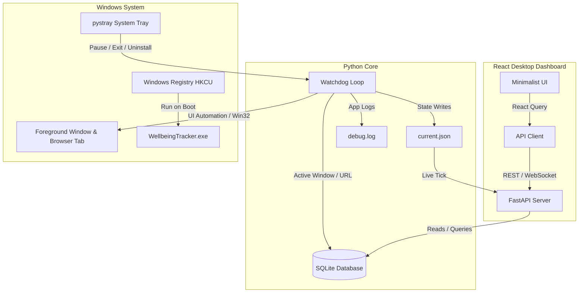

# WindowsTimeManagement — Wellbeing Tracker

A native, self-contained Windows digital wellbeing application designed to log screen time and website activity in the background. The application runs invisibly, registers for startup execution, and logs precise application and web domain usage (including YouTube and custom domains) across all major web browsers—including incognito and private browsing sessions.

The user interface is built as a dark, deconstructed minimalist dashboard using React, Vite, and Tailwind CSS, served locally and displayed in a lightweight, native WebView2 desktop container.

---

## Technical Features

*   **Browser Activity Tracking**: Utilizes Windows UI Automation APIs to retrieve active browser address bar URLs. Falls back to window title parsing when automation endpoints are restricted.
*   **Private Session Logging**: Tracks active browser tab domains during incognito and InPrivate sessions using OS accessibility hooks.
*   **System Tray Integration**: Operates silently in the Windows notification tray. The tray menu allows users to pause/resume tracking, launch the dashboard, uninstall, or exit.
*   **Deconstructed Minimalist UI**: Features a high-contrast dashboard displaying weekly screen-time trends, a 24-hour activity heatmap, top application listings, top website lists, and a raw activity telemetry log.
*   **Integrated History Strip**: Allows navigation of past logs using a horizontal calendar strip and an inline custom date selector directly on the dashboard screen.
*   **Diagnostics Panel**: Displays system resource usage, active tracker configuration parameters, and a live tail of application logs from `debug.log`.
*   **Standalone Portable Binary**: Compiles into a single, dependency-free binary containing the embedded frontend and local server assets.

---

## Architecture



---

## Getting Started

### Running the Executable (Production)
1. Copy `WellbeingTracker.exe` from the latest release to any directory on the local system.
2. Double-click the executable to launch the application.
3. The application will register itself with the user startup registry key and run silently in the system tray.
4. Double-click the system tray icon to open the local dashboard.

### Developer Setup
To run the tracker in development mode:

1. **Clone the repository**:
    ```bash
    git clone https://github.com/amayIIp/WindowsTimeManagement.git
    cd WindowsTimeManagement
    ```
2. **Set up Backend**:
    ```bash
    pip install -r requirements.txt
    python main.py
    ```
3. **Set up Frontend**:
    ```bash
    cd dashboard
    npm install
    npm run dev
    ```

---

## Running the Automated Audits

To verify the database schema, domain parser rules, database commits, and FastAPI routes end-to-end, execute:

```bash
python audit.py
```

The audit script spins up a local server thread, queries endpoints to validate outputs, tests real-time database write operations, and ensures tracker stability.

---

## Uninstallation

To cleanly remove the application and registry configurations:
1. **Via System Tray**: Right-click the tray icon and select **Uninstall**.
2. **Via Command Line**: Execute:
    ```bash
    python uninstall.py
    ```

Both procedures unregister the startup registry keys and terminate active tracking threads while preserving your historical database (`wellbeing.db`).

---

## Compilation

To package the standalone binary:
1. Compile the React frontend assets:
    ```bash
    cd dashboard
    npm run build
    cd ..
    ```
2. Build the PyInstaller package:
    ```bash
    python -m PyInstaller WellbeingTracker.spec --noconfirm
    ```
3. The standalone executable is generated at `dist/WellbeingTracker.exe`.
