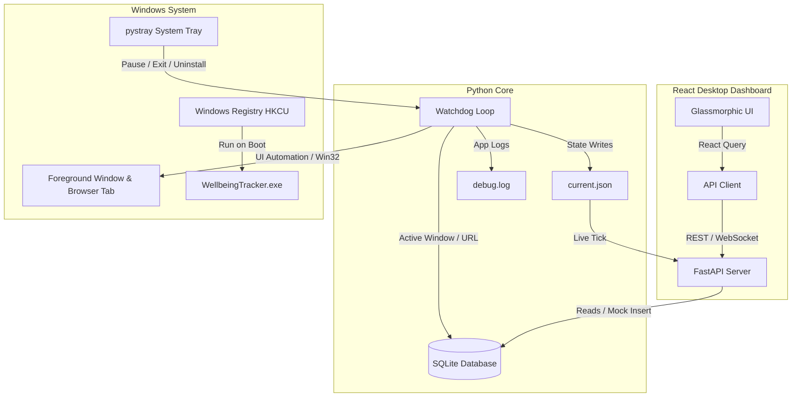

# WindowsTimeManagement — Wellbeing Tracker

A premium, self-contained, native Windows digital wellbeing application that runs invisibly in the background, survives reboots, and accurately logs exact screen time and website activity (including YouTube and other domains) across all major browsers—even in incognito/InPrivate modes.

Designed with a stunning, high-performance dark glassmorphic dashboard interface built on React, Vite, and TailwindCSS.

---

## 🚀 Key Features

*   **🕵️ True Browser Tracking**: Uses Windows UI Automation APIs to read the browser address bar. Falls back to smart window title parsing when UI Automation is unavailable.
*   **🔒 Incognito & InPrivate Support**: Tracks browser tab domains even in private browsing modes via OS accessibility hooks.
*   **⚙️ Native System Tray**: Lives silently in your Windows notification tray. Right-click to Pause/Resume, Open Dashboard, Uninstall, or Exit.
*   **💻 Native App Window**: Serves the dashboard locally and launches in a native, lightweight desktop frame (Edge HTML5/WebView2) instead of a standard browser tab.
*   **💎 Glassmorphic Dashboard**: Beautiful charts (Weekly screen-time trends, 24-hour activity heatmaps, top applications, top websites, and interactive dot-timeline).
*   **📅 Full History Viewer**: Query and analyze usage stats for any day in history using custom date navigation buttons.
*   **🛠️ Diagnostics & Simulator**: Includes a system metrics dashboard, live log terminal viewer reading from `debug.log`, and a simulator to generate 7 days of mock activity data for instant testing.
*   **📦 100% Standalone**: Compiled into a single, dependency-free binary (`dist/WellbeingTracker.exe`). Sharing it is as simple as copying the `.exe` file.

---

## 📐 Architecture



---

## 🛠️ Getting Started

### sharing & Running (Production)
1.  Navigate to the `dist` folder.
2.  Copy `WellbeingTracker.exe` to any folder on your computer.
3.  Double-click `WellbeingTracker.exe` to launch.
4.  A native welcome dialog will confirm that auto-start on login has been registered. You'll see a new teal circle icon in your system tray.
5.  Double-click the tray icon to open the dashboard!

### Developer Setup (Dev Mode)
To run the project in development mode:

1.  **Clone the repository**:
    ```bash
    git clone https://github.com/amayIIp/WindowsTimeManagement.git
    cd WindowsTimeManagement
    ```
2.  **Set up Backend**:
    ```bash
    pip install -r requirements.txt
    python main.py
    ```
3.  **Set up Frontend**:
    ```bash
    cd dashboard
    npm install
    npm run dev
    ```

---

## 🧪 Running the Audit Suite

To verify that the database schema, real-time update engine, domain parser, and FastAPI server work cleanly end-to-end, execute the automated test suite:

```bash
python audit.py
```

The audit script runs a local uvicorn thread, queries endpoints using `urllib`, validates fallback matching cases, tests real-time database updates (preventing data loss on crash), and inserts simulation mock data to confirm system readiness.

---

## 🗑️ Uninstalling

You can fully remove the application in two ways:
1.  **Via Tray Menu**: Right-click the system tray icon and select **Uninstall**.
2.  **Via Command Line**: Run:
    ```bash
    python uninstall.py
    ```

Both methods cleanly remove the startup registry entry, stop active background processes, and show a native completion popup while preserving your database file (`wellbeing.db`).

---

## 📦 Building from Source

To compile the single-file executable yourself:
1.  Build the frontend assets:
    ```bash
    cd dashboard
    npm run build
    cd ..
    ```
2.  Run PyInstaller:
    ```bash
    python -m PyInstaller WellbeingTracker.spec --noconfirm
    ```
3.  The single-file executable will be ready at `dist/WellbeingTracker.exe`.
